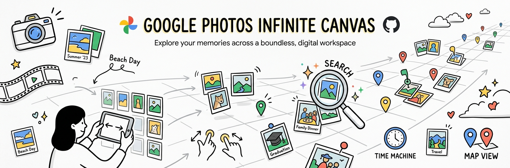
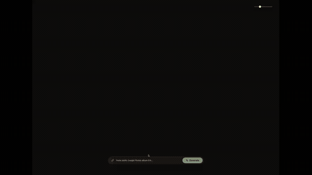

<p align="center">
  
</p>

# Google Photos Infinite Canvas

An interactive, infinite-canvas explorer and visualizer for Google Photos public shared albums. Built with React, Vite, Tailwind CSS, and a headless extraction backend powered by Express and Puppeteer.

🔗 **Live Demo**: [https://choosing-fastest-family-area.trycloudflare.com/](https://choosing-fastest-family-area.trycloudflare.com/)

---

## Overview

**Google Photos Infinite Canvas** transforms standard Google Photos shared albums into an endless, spatial masonry canvas. Instead of scrolling linearly down a traditional feed, you can freely pan, pinch, and zoom in all directions to explore your photo collections dynamically.

### Demo

<p align="center">
  
</p>

### Key Features

- **Endless Spatial Canvas**: Continuous pan & zoom across an infinite, procedurally generated masonry grid.
- **Universal Input Controls**:
  - Desktop: Click-and-drag panning, mouse wheel / trackpad zoom with cursor-anchored scaling.
  - Mobile & Touch: Single-finger dragging, two-finger pinch-to-zoom with smooth momentum.
  - Keyboard & UI shortcuts for quick navigation and resetting views.
- **Instant Album Ingestion**: Paste any public Google Photos album share link (`photos.app.goo.gl` or `photos.google.com/share/...`) to extract and populate the canvas on the fly.
- **Zero API Key Requirement**: Uses headless browser DOM extraction (Puppeteer) to resolve high-resolution CDN assets without needing Google Cloud OAuth or API credentials.
- **Privacy-Preserving**: No photos or tokens are stored on the server. Images stream directly from Google's high-performance content delivery network.

---

## Tech Stack

- **Frontend**: React 18, Vite, Tailwind CSS, Lucide Icons
- **Backend & Scraper**: Node.js, Express, Puppeteer (Headless Chrome)
- **Deployment & Tooling**: PostCSS, Autoprefixer, ES Modules

---

## Getting Started

### Prerequisites

- Node.js (v18 or newer recommended)
- Google Chrome or Chromium installed (for Puppeteer extraction)

### Installation

```bash
# Clone the repository
git clone https://github.com/jharohit/google-photos-infinite-canvas.git
cd google-photos-infinite-canvas

# Install dependencies
npm install
```

### Running Locally

You can launch both the extraction server and Vite client:

```bash
# Start the full-stack app (Server on port 3020)
npm run build
npm start
```

Or for local development with hot reload:

```bash
# In terminal 1 (Frontend):
npm run dev

# In terminal 2 (Scraper backend):
node server.js
```

Open `http://localhost:3020` (or the Vite dev server URL) in your browser.

---

## Usage

1. Open any album in **Google Photos**.
2. Click **Share** > **Create link** (ensure link sharing is turned on).
3. Paste the share link into the input bar in the Infinite Canvas interface and click **Load**.
4. Explore your photos using your trackpad, mouse, or touch gestures.

---

## License

MIT License.
